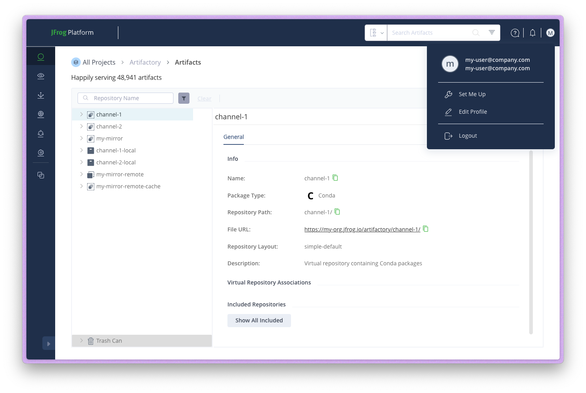
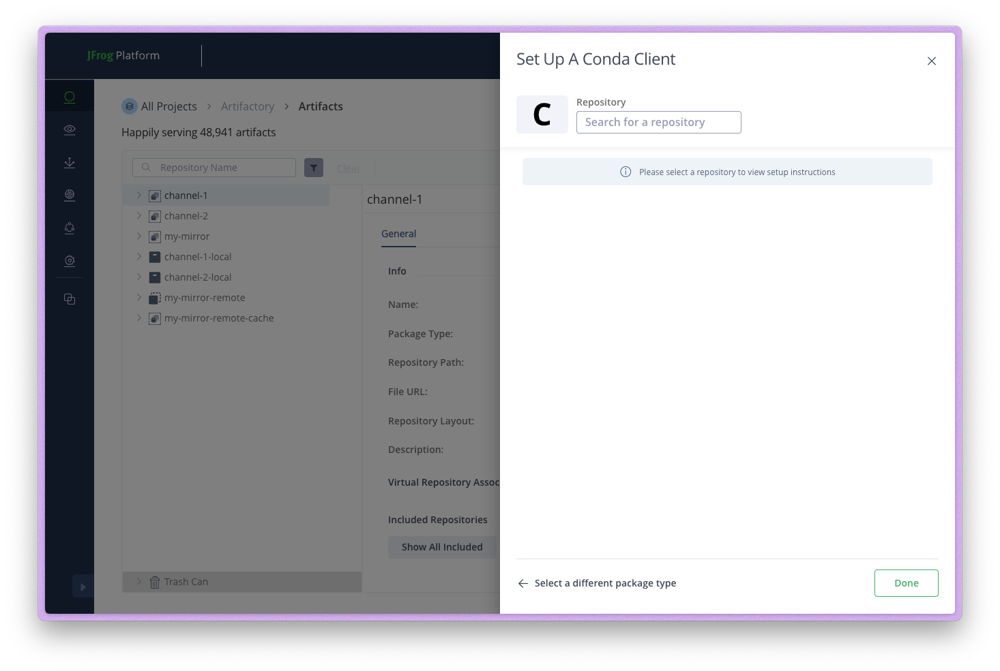
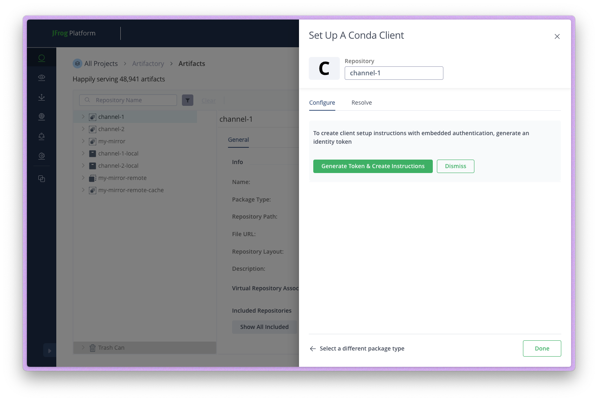
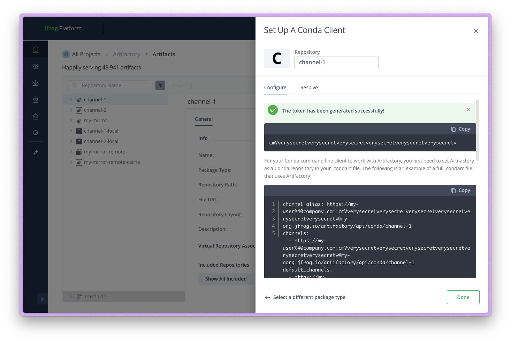

# JFrog Artifactory

JFrog Artifactory is an enterprise-grade artifact repository manager that supports conda packages.
This guide explains how to configure pixi to use Artifactory as a private conda channel.

## Setting up Artifactory

### 1. Create a conda repository

In your Artifactory instance, create a repository with the "Conda" package type.
The repository URL will be in the format: `https://my-org.jfrog.io/artifactory/<repository-name>/`


### 2. Generate an access token

To authenticate with Artifactory, you need to generate an access token:

1. Click on your user profile in the top-right corner and select **Set Me Up**

    

2. Select **conda** as the package type

    

3. Select your conda repository

    

4. Click **Generate Token & Create Instructions**

    

5. Copy the generated token

    

## Authenticating with pixi

Use the `pixi auth login` command to authenticate with your Artifactory instance:

```shell
pixi auth login --token <artifactory-token> my-org.jfrog.io
```

This stores the token securely using your system's credential manager. See [Authentication](authentication.md) for more details on credential storage.

## Configuring channels

Add your Artifactory channel to your `pixi.toml`:

```toml
[workspace]
channels = ["https://my-org.jfrog.io/artifactory/channel-1", "conda-forge"]
```

!!!note "Strict channel priority"
    Pixi uses strict channel priority. Packages are always resolved from the first channel that contains them.
    In the example above, if a package exists in both your Artifactory channel and conda-forge,
    the version from Artifactory will always be used.

    This is useful for:

    - Overriding specific packages with internal builds
    - Ensuring consistent package versions across your organization
    - Using private packages that aren't available on public channels

    See [Channel Logic](../advanced/channel_logic.md) for more details on how channel priority works.

## Example configuration

Here's a complete example using Artifactory with conda-forge as a fallback:

```toml
[workspace]
name = "my-project"
channels = ["https://my-org.jfrog.io/artifactory/internal-packages", "conda-forge"]
platforms = ["linux-64", "osx-arm64", "win-64"]

[dependencies]
python = ">=3.11"
# This will come from your Artifactory channel if available there
my-internal-package = "*"
# These will come from conda-forge
numpy = ">=1.24"
pandas = ">=2.0"
```
