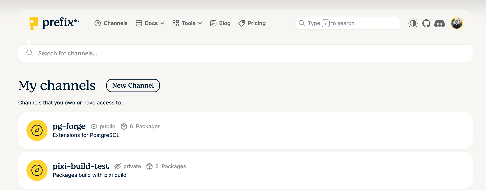
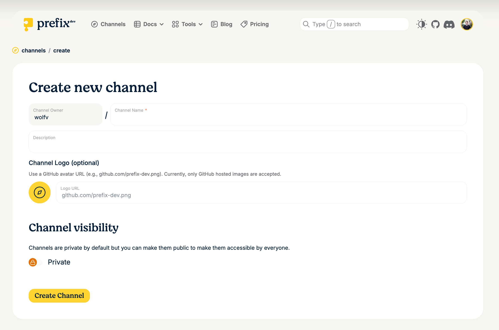
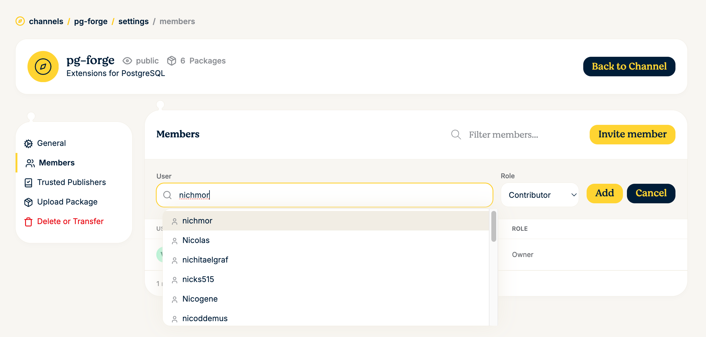
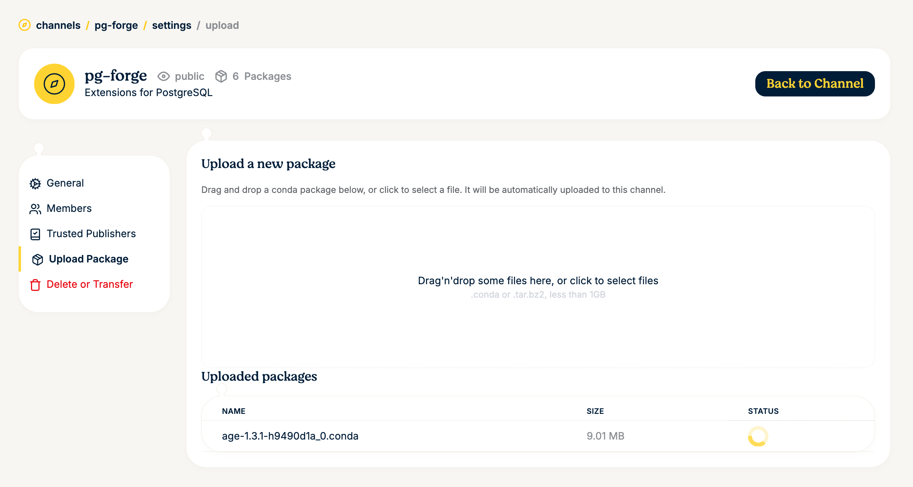
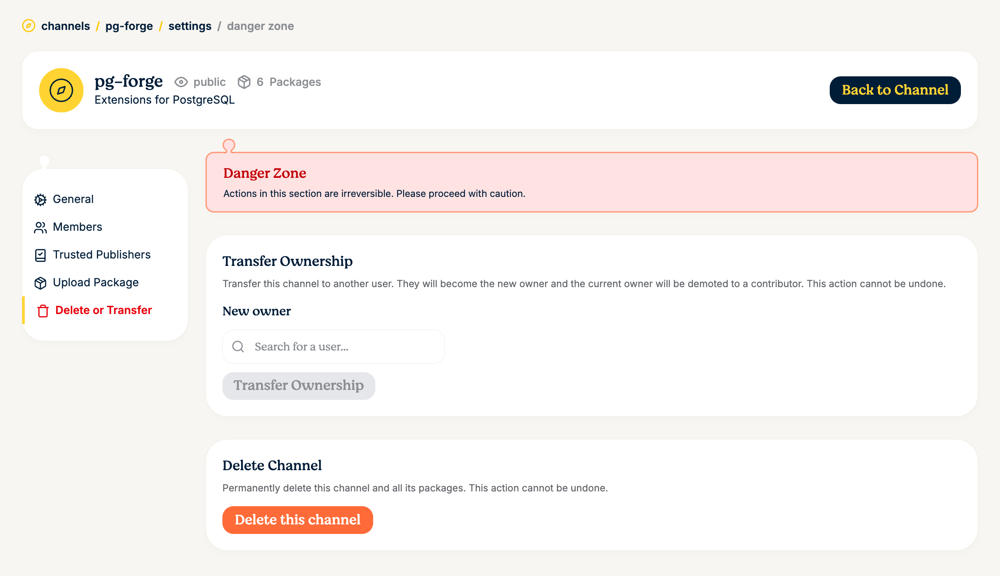
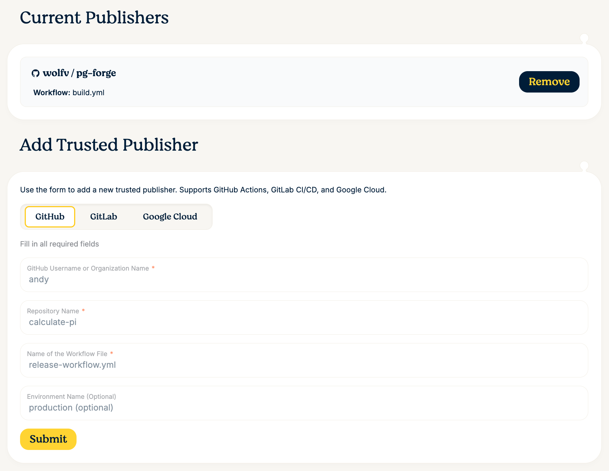

# Prefix.dev

Prefix.dev offers a fast, modern package hosting solution for Conda packages.

## Setting up your own Channel on prefix.dev

First, sign up for an account on prefix.dev, using Github, Google or your email address.
Create a channel by navigating to `Channels` and clicking "New Channel"



Fill in the channel creation form: choose a _name_, a description and whether the channel should be public or private. Public channels are accessible without authentication. You can also use a GitHub avatar URL as a channel logo (e.g. `https://github.com/myaccount.png`).



You have your channel! Now you can start uploading packages or adding members.

## Adding more channel members

To manage members, navigate to your channel's settings and click on **Members** in the sidebar.


To invite a new member, click **Invite member**, search for their username and select a role (e.g. Contributor or Viewer), then click **Add**. Note: there can be only a single channel _owner_, but you can transfer channel ownership in the channel settings as well.



## Uploading packages

You can upload packages directly through the web interface. Navigate to **Upload Package** in the channel settings sidebar. Drag and drop `.conda` or `.tar.bz2` files (up to 1 GB) into the upload area, or click to select files from your filesystem.



Alternatively, you can build and publish packages using the `pixi` CLI. To do so locally, you need to generate an API key for your user account (User -> Settings -> Api Keys).

The easiest way is to use `pixi publish`, which builds the package and uploads it in one step:

```bash
# Build and publish in one step
pixi publish --to https://prefix.dev/<channel-name>
```

You can also build and upload separately for more control:

```bash
# Build first, then upload the artifact
pixi build --output-dir ./output
pixi upload prefix --channel <channel-name> ./output/my-package-1.0.0-h123_0.conda
```

For authentication, log in with `pixi auth login` or pass an API key:

```bash
# Store credentials in the keychain
pixi auth login --token $PREFIX_API_KEY https://prefix.dev

# Or pass the API key directly when uploading
pixi upload prefix --channel <channel-name> <package-file> --api-key $PREFIX_API_KEY
```

## Using the channel in pixi

Once your channel is set up and has packages, you can use it in your `pixi.toml`:

```toml
[workspace]
channels = ["https://prefix.dev/<channel-name>"]
```

For private channels, you need to authenticate first:

```bash
pixi auth login --token <your-token> https://prefix.dev
```

## Deleting or transferring a channel

Under **Delete or Transfer** in the channel settings, you can transfer ownership of the channel to another user or permanently delete the channel and all its packages.



!!! warning
    Deleting a channel is irreversible and will remove all packages associated with it. Proceed with caution.

## Trusted Publishing

Trusted publishing allows CI/CD pipelines to upload packages to your channel without needing long-lived API tokens. Instead, it uses OIDC (OpenID Connect) to establish trust between your CI provider and prefix.dev. This is more secure because credentials are short-lived and automatically scoped to specific workflows.

Prefix.dev supports trusted publishing from **GitHub Actions**, **GitLab CI/CD**, and **Google Cloud**.

### Setting up a trusted publisher

Navigate to **Trusted Publishers** in your channel settings sidebar and fill in the required fields:

- **GitHub Username or Organization Name** — the owner of the repository
- **Repository Name** — the repository that will publish packages
- **Name of the Workflow File** — the workflow file that triggers the upload (e.g. `release-workflow.yml`)
- **Environment Name** (optional) — restrict publishing to a specific GitHub environment (e.g. `production`)



### Using trusted publishing in GitHub Actions

Once configured, your GitHub Actions workflow can upload packages without any stored secrets:

```yaml
jobs:
  build-and-upload:
    runs-on: ubuntu-latest
    permissions:
      id-token: write  # Required for OIDC token
    steps:
      - uses: actions/checkout@v4

      - uses: prefix-dev/setup-pixi@v0.8.0

      # Build and publish in one step — no stored secrets needed!
      - run: pixi publish --to https://prefix.dev/<channel-name>

      # Or with sigstore attestation for supply chain security:
      # - run: pixi publish --to https://prefix.dev/<channel-name> --generate-attestation
```

With trusted publishing configured, pixi automatically handles the OIDC token exchange with prefix.dev — no stored API keys required.
