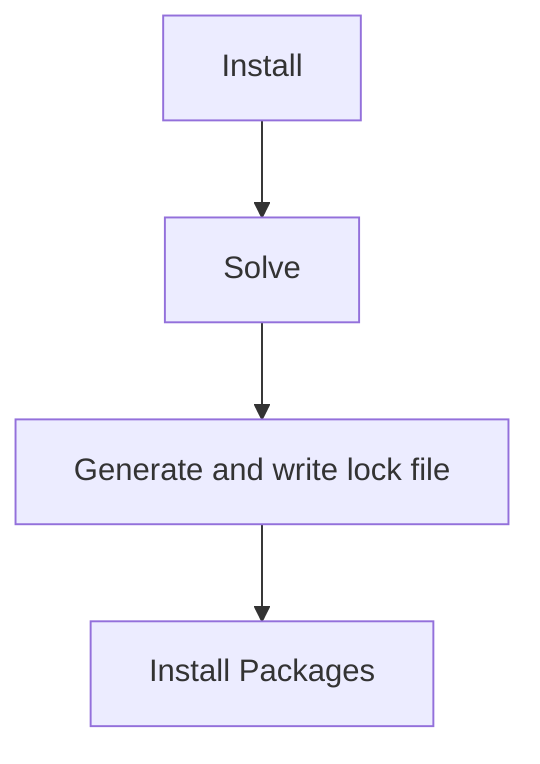

# The `pixi.lock` lock file

> A lock file is the protector of the environments, and pixi is the key to unlock it.

## What is a lock file?

A lock file locks the environment in a specific state.
Within pixi a lock file is a description of the packages in an environment.
The lock file contains two definitions:

- The environments that are used in the project with their complete set of packages. e.g.:

  ```yaml
  environments:
      default:
          channels:
            - url: https://conda.anaconda.org/conda-forge/
          packages:
              linux-64:
              ...
              - conda: https://conda.anaconda.org/conda-forge/linux-64/python-3.12.2-hab00c5b_0_cpython.conda
              ...
              osx-64:
              ...
              - conda: https://conda.anaconda.org/conda-forge/osx-64/python-3.12.2-h9f0c242_0_cpython.conda
              ...
  ```

  - The definition of the packages themselves. e.g.:

    ```yaml
    - kind: conda
      name: python
      version: 3.12.2
      build: h9f0c242_0_cpython
      subdir: osx-64
      url: https://conda.anaconda.org/conda-forge/osx-64/python-3.12.2-h9f0c242_0_cpython.conda
      sha256: 7647ac06c3798a182a4bcb1ff58864f1ef81eb3acea6971295304c23e43252fb
      md5: 0179b8007ba008cf5bec11f3b3853902
      depends:
        - bzip2 >=1.0.8,<2.0a0
        - libexpat >=2.5.0,<3.0a0
        - libffi >=3.4,<4.0a0
        - libsqlite >=3.45.1,<4.0a0
        - libzlib >=1.2.13,<1.3.0a0
        - ncurses >=6.4,<7.0a0
        - openssl >=3.2.1,<4.0a0
        - readline >=8.2,<9.0a0
        - tk >=8.6.13,<8.7.0a0
        - tzdata
        - xz >=5.2.6,<6.0a0
      constrains:
        - python_abi 3.12.* *_cp312
      license: Python-2.0
      size: 14596811
      timestamp: 1708118065292
    ```

## Why a lock file

Pixi uses the lock file for the following reasons:

- To save a working installation state, without copying the entire environment's data.
- To ensure the project configuration is aligned with the installed environment.
- To give the user a file that contains all the information about the environment.

This gives you (and your collaborators) a way to really reproduce the environment they are working in.
Using tools such as docker suddenly becomes much less necessary.

## When is a lock file generated?

A lock file is generated when you install a package.
More specifically, a lock file is generated from the solve step of the installation process.
The solve will return a list of packages that are to be installed, and the lock file will be generated from this list.
This diagram tries to explain the process:



## How to use a lock file

!!! Warning "Do not edit the lock file"
    A lock file is a machine only file, and should not be edited by hand.

That said, the `pixi.lock` is human-readable, so it's easy to track the changes in the environment.
We recommend you track the lock file in `git` or other version control systems.
This will ensure that the environment is always reproducible and that you can always revert back to a working state, in case something goes wrong.
The `pixi.lock` and the manifest file `pixi.toml`/`pyproject.toml` should always be in sync.

Running the following commands will check and automatically update the lock file if you changed any dependencies:

- `pixi install`
- `pixi run`
- `pixi shell`
- `pixi shell-hook`
- `pixi tree`
- `pixi list`
- `pixi add`
- `pixi remove`

All the commands that support the interaction with the lock file also include some lock file usage options:

- `--frozen`: install the environment as defined in the lock file, doesn't update `pixi.lock` if it isn't up-to-date with [manifest file](../reference/project_configuration.md). It can also be controlled by the `PIXI_FROZEN` environment variable (example: `PIXI_FROZEN=true`).
- `--locked`: only install if the `pixi.lock` is up-to-date with the [manifest file](../reference/project_configuration.md)[^1]. It can also be controlled by the `PIXI_LOCKED` environment variable (example: `PIXI_LOCKED=true`). Conflicts with `--frozen`.

!!! Note "Syncing the lock file with the manifest file"
    The lock file is always matched with the whole configuration in the manifest file.
    This means that if you change the manifest file, the lock file will be updated.
    ```mermaid
    flowchart TD
        C[manifest] --> A[lockfile] --> B[environment]
    ```

## Lockfile satisfiability

The lock file is a description of the environment, and it should always be satisfiable.
Satisfiable means that the given manifest file and the created environment are in sync with the lockfile.
If the lock file is not satisfiable, pixi will generate a new lock file automatically.

Steps to check if the lock file is satisfiable:

- All `environments` in the manifest file are in the lock file
- All `channels` in the manifest file are in the lock file
- All `packages` in the manifest file are in the lock file, and the versions in the lock file are compatible with the requirements in the manifest file, for both `conda` and `pypi` packages.
  - Conda packages use a `matchspec` which can match on all the information we store in the lockfile, even `timestamp`, `subdir` and `license`.
- If `pypi-dependencies` are added, all `conda` package that are python packages in the lock file have a `purls` field.
- All hashes for the `pypi` editable packages are correct.
- There is only a single entry for every package in the lock file.

If you want to get more details checkout the [actual code](https://github.com/prefix-dev/pixi/blob/main/src/lock_file/satisfiability.rs) as this is a simplification of the actual code.

## The version of the lock file

The lock file has a version number, this is to ensure that the lock file is compatible with the local version of `pixi`.

```yaml
version: 4
```

Pixi is backward compatible with the lock file, but not forward compatible.
This means that you can use an older lock file with a newer version of `pixi`, but not the other way around.

## Your lock file is big

The lock file can grow quite large, especially if you have a lot of packages installed.
This is because the lock file contains all the information about the packages.

1. We try to keep the lock file as small as possible.
2. It's always smaller than a docker image.
3. Downloading the lock file is always faster than downloading the incorrect packages.

## You don't need a lock file because...

If you can not think of a case where you would benefit from a fast reproducible environment, then you don't need a lock file.

But take note of the following:

- A lock file allows you to run the same environment on different machines, think CI systems.
- It also allows you to go back to a working state if you have made a mistake.
- It helps other users onboard to your project as they don't have to figure out the environment setup or solve dependency issues.

## Removing the lock file

If you want to remove the lock file, you can simply delete it.

```bash
rm pixi.lock
```

This will remove the lock file, and the next time you run a command that requires the lock file, it will be generated again.

!!! Warning "Note"
    This does remove the locked state of the environment, and the environment will be updated to the latest version of the packages.
