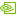

  <svg class="signal-theme-defs" aria-hidden="true" focusable="false"><defs><linearGradient id="sgNodePiece" x1="0" y1="0" x2="1" y2="1"><stop offset="0" stop-color="#122a5e"/><stop offset="1" stop-color="#251b66"/></linearGradient><linearGradient id="sgCardPiece" x1="0" y1="0" x2="0" y2="1"><stop offset="0" stop-color="#ffffff"/><stop offset="1" stop-color="#f4f2ff"/></linearGradient></defs></svg>
  <section class="signal-hero" aria-labelledby="signal-title">
    

      <svg class="signal-puzzle-field" viewBox="0 0 56 46" preserveAspectRatio="xMidYMid meet">
        <path d="M54.3642 26.9458C56.2392 25.0794 56.3899 22.6411 54.6346 20.5853C49.04 14.0338 43.2098 7.69779 37.1285 1.5943C35.2636 -0.277942 32.7836 -0.366601 30.7674 1.34661C28.8583 2.96961 26.2786 5.26984 24.643 6.76611C23.8305 7.51508 23.7989 8.71303 24.5812 9.56171C25.0037 10.0201 25.552 10.2473 26.0955 10.2495C26.1032 10.252 26.1104 10.2591 26.1179 10.2588C26.6436 10.254 27.1682 10.114 27.6956 10.0999C28.339 10.0829 28.9948 10.1417 29.6166 10.3089C30.836 10.6363 31.9114 11.2453 32.8503 12.2639C35.3196 14.9427 35.36 18.9371 32.4325 21.6356C29.4678 24.3685 25.5082 24.0924 22.8397 21.1974C21.2373 19.4591 20.5745 17.2221 21.2551 15.0184C21.2641 14.9898 21.2656 14.9621 21.2727 14.934C21.2754 14.9214 21.2778 14.909 21.2806 14.8964C21.2977 14.8154 21.3067 14.7354 21.3079 14.6566C21.3479 14.1172 21.1653 13.5547 20.7448 13.0985C20.0596 12.3552 19.0566 12.2131 18.2724 12.6922C18.1947 12.7262 18.1065 12.7913 17.9538 12.9327C16.3325 14.4373 13.5775 17.0587 11.7079 18.9159C10.7887 19.8289 10.2157 21.0687 10.2615 22.3741C10.3134 23.8637 11.182 24.8067 11.934 25.994C12.1933 26.4034 12.4035 26.8598 12.4077 27.3536C12.4135 28.0678 11.9631 28.7483 11.3371 29.094C10.6545 29.4705 9.92471 29.4088 9.19526 29.2518C8.51982 29.1065 7.85406 29.0121 7.16017 29.0518C5.67966 29.1359 4.28596 29.7573 3.19687 30.7612C0.232114 33.4941 -0.00407043 37.5032 2.75315 40.4944C5.47613 43.4485 9.43503 43.7401 12.2322 41.1618C13.3222 40.157 14.1396 38.8532 14.4332 37.3916C14.5728 36.6965 14.5894 35.9839 14.4939 35.2831C14.398 34.5798 14.2201 33.943 14.5297 33.2549C14.7051 32.8655 14.9925 32.5235 15.3646 32.309C17.0099 31.3594 18.258 33.0133 19.2317 34.0775C20.5969 35.5696 21.9745 37.0504 23.3653 38.5183C25.2019 40.4567 27.0612 42.3736 28.9436 44.2674C30.7244 46.0588 33.3274 46.1996 35.305 44.5148C41.8869 38.9072 48.2367 33.0457 54.3651 26.9455L54.3642 26.9458Z"></path>
      </svg>
    

    

      <header class="signal-intro">
        
The package manager for your entire project

        <h1 id="signal-title">One package manager. Every part of your  stack.</h1>
        
Pixi manages runtimes, compilers, libraries, tools, and tasks together. Define the project once and run it reproducibly on Linux, macOS, and Windows.

        

          <a class="signal-button signal-button--primary" href="first_workspace/">Get started →</a>
          <a class="signal-button signal-button--secondary" href="https://github.com/prefix-dev/pixi">View on GitHub  ↗</a>
        

        

          <code aria-label="Shell install command">$ curl -fsSL https://pixi.sh/install.sh | sh</code>
          <button type="button" class="signal-install__copy" data-install-copy data-command="curl -fsSL https://pixi.sh/install.sh | sh" aria-label="Copy install command"><svg class="signal-install__icon-copy" viewBox="0 0 24 24" aria-hidden="true"><rect x="9" y="9" width="11" height="11" rx="2"/><path d="M15 9V6a2 2 0 0 0-2-2H6a2 2 0 0 0-2 2v7a2 2 0 0 0 2 2h3"/></svg><svg class="signal-install__icon-check" viewBox="0 0 24 24" aria-hidden="true"><path d="m5 12.5 4.5 4.5L19 7.5"/></svg></button>
          
        

        <ul class="signal-callouts" aria-label="Pixi benefits">
          <li>Language agnostic</li>
          <li>One cross-platform lockfile</li>
          <li>No root required</li>
        </ul>
      </header>

      

        

          

            
            <strong>workspace — pixi</strong>
          

          

            <pre><code>$ pixi init
$ pixi add cmake rust nodejs go lua
$ pixi task add dev "cargo run"
$ pixi run dev</code></pre>
            
          

        

        

        <section class="signal-constellation" aria-labelledby="constellation-title">
          

            
Dependency field

            <h2 id="constellation-title">One lockfile resolves the whole project</h2>
            
Choose any node to see the command source adapt.

          

          

            <svg class="signal-map__paths" data-signal-connectors preserveAspectRatio="none" aria-hidden="true">
              <path data-signal-connector data-node="PyTorch" data-tier="top" />
              <path data-signal-connector data-node="C++" data-tier="top" />
              <path data-signal-connector data-node="Rust" data-tier="top" />
              <path data-signal-connector data-node="Node.js" data-tier="top" />
              <path data-signal-connector data-node="CUDA" data-tier="bottom" />
              <path data-signal-connector data-node="ROS" data-tier="bottom" />
              <path data-signal-connector data-node="Go" data-tier="bottom" />
              <path data-signal-connector data-node="Lua" data-tier="bottom" />
              <g class="signal-map__endpoints">
                <circle data-signal-endpoint data-node="PyTorch" data-tier="top" r="5" />
                <circle data-signal-endpoint data-node="C++" data-tier="top" r="5" />
                <circle data-signal-endpoint data-node="Rust" data-tier="top" r="5" />
                <circle data-signal-endpoint data-node="Node.js" data-tier="top" r="5" />
                <circle data-signal-endpoint data-node="CUDA" data-tier="bottom" r="5" />
                <circle data-signal-endpoint data-node="ROS" data-tier="bottom" r="5" />
                <circle data-signal-endpoint data-node="Go" data-tier="bottom" r="5" />
                <circle data-signal-endpoint data-node="Lua" data-tier="bottom" r="5" />
              </g>
            </svg>

            <button class="signal-node signal-node--pytorch" type="button" data-label="PyTorch" data-title="AI" data-piece-tier="top" data-packages="python pytorch-gpu cuda-version" data-task="python train.py" aria-label="Preview PyTorch dependencies" aria-pressed="false"><svg class="signal-node__piece" aria-hidden="true"><path /></svg>PyTorch</button>
            <button class="signal-node signal-node--cpp" type="button" data-label="C++" data-piece-tier="top" data-packages="cmake clang libstdcxx-ng" data-task="cmake --build build" aria-label="Preview C++ dependencies" aria-pressed="false"><svg class="signal-node__piece" aria-hidden="true"><path /></svg>C++</button>
            <button class="signal-node signal-node--rust" type="button" data-label="Rust" data-piece-tier="top" data-packages="rust cargo rust-src" data-task="cargo run" aria-label="Preview Rust dependencies" aria-pressed="false"><svg class="signal-node__piece" aria-hidden="true"><path /></svg>Rust</button>
            <button class="signal-node signal-node--node" type="button" data-label="Node.js" data-title="Web" data-piece-tier="top" data-packages="nodejs pnpm typescript" data-task="npm run dev" aria-label="Preview Node.js dependencies" aria-pressed="false"><svg class="signal-node__piece" aria-hidden="true"><path /></svg>Node.js</button>

            

              <svg viewBox="0 0 24 24" aria-hidden="true"><path d="M7 10V8a5 5 0 0 1 10 0v2m-11 0h12v10H6V10Zm6 4v2" /></svg>
              pixi.lock
              <small>one resolved graph</small>
            

            <button class="signal-node signal-node--cuda" type="button" data-label="CUDA" data-piece-tier="bottom" data-packages="cuda-nvcc cuda-cudart" data-task="nvcc main.cu" aria-label="Preview CUDA dependencies" aria-pressed="false"><svg class="signal-node__piece" aria-hidden="true"><path /></svg>CUDA</button>
            <button class="signal-node signal-node--ros" type="button" data-label="ROS" data-title="Robotics" data-piece-tier="bottom" data-packages="ros-humble-desktop colcon-common-extensions" data-task="ros2 launch app dev" aria-label="Preview ROS dependencies" aria-pressed="false"><svg class="signal-node__piece" aria-hidden="true"><path /></svg>ROS</button>
            <button class="signal-node signal-node--go" type="button" data-label="Go" data-piece-tier="bottom" data-packages="go gopls golangci-lint" data-task="go run ." aria-label="Preview Go dependencies" aria-pressed="false"><svg class="signal-node__piece" aria-hidden="true"><path /></svg>Go</button>
            <button class="signal-node signal-node--lua" type="button" data-label="Lua" data-piece-tier="bottom" data-packages="lua luajit luarocks" data-task="lua main.lua" aria-label="Preview Lua dependencies" aria-pressed="false"><svg class="signal-node__piece" aria-hidden="true"><path /></svg>Lua</button>
          

          
Hover, focus, or tap a package node

        </section>

        <ul class="signal-platforms" aria-label="Supported operating systems">
          <li><svg viewBox="0 0 24 24" aria-hidden="true"><path d="M12 3c-2 0-3 2-3 4v2c-1 1-2 3-2 5l-2 3 3 1 1 3h6l1-3 3-1-2-3c0-2-1-4-2-5V7c0-2-1-4-3-4Z" /></svg>Linux</li>
          <li><svg viewBox="0 0 24 24" aria-hidden="true"><path d="M16.8 12.7c0-2.5 2.1-3.7 2.2-3.8a4.8 4.8 0 0 0-3.8-2c-1.6-.2-3.1 1-3.9 1s-2-1-3.4-1c-1.7 0-3.3 1-4.2 2.5-1.8 3.1-.5 7.7 1.3 10.2.9 1.2 1.9 2.6 3.3 2.5 1.3 0 1.8-.8 3.4-.8s2 .8 3.4.8c1.4 0 2.3-1.3 3.1-2.5 1-1.4 1.4-2.8 1.4-2.9-.1 0-2.8-1.1-2.8-4Zm-2.7-7.5A4.5 4.5 0 0 0 15.2 2a4.6 4.6 0 0 0-3 1.5 4.2 4.2 0 0 0-1.1 3.1 3.8 3.8 0 0 0 3-1.4Z" /></svg>macOS</li>
          <li><svg viewBox="0 0 24 24" aria-hidden="true"><path d="m3 5 8-1v8H3V5Zm9-1.2L21 2v10h-9V3.8ZM3 13h8v8l-8-1v-7Zm9 0h9v10l-9-1.8V13Z" /></svg>Windows</li>
        </ul>
      

    

  </section>

  <section class="signal-below" aria-labelledby="whole-project-title">
    

      
A complete development environment

      <h2 id="whole-project-title">Your whole project, one workspace</h2>
      
Bring system-level and language-specific dependencies into the same isolated environment. Pixi keeps every contributor and CI runner on the same resolved set.

    

    

      <article data-puzzle-piece><svg class="signal-capability__piece" aria-hidden="true"><path /></svg>
<svg viewBox="0 0 24 24"><path d="M12 3 3 7.5l9 4.5 9-4.5L12 3Z"/><path d="m3 12 9 4.5 9-4.5"/><path d="m3 16.5 9 4.5 9-4.5"/></svg>01
<h3>Runtimes</h3>
Pin Node.js, Python, JVMs, and the runtimes your project actually uses.
</article>
      <article data-puzzle-piece><svg class="signal-capability__piece" aria-hidden="true"><path /></svg>
<svg viewBox="0 0 24 24"><rect x="7" y="7" width="10" height="10" rx="1.5"/><rect x="10.6" y="10.6" width="2.8" height="2.8" rx="0.6"/><path d="M9.5 4.5V7M14.5 4.5V7M9.5 17v2.5M14.5 17v2.5M4.5 9.5H7M4.5 14.5H7M17 9.5h2.5M17 14.5h2.5"/></svg>02
<h3>Compilers</h3>
Resolve C, C++, Rust, CUDA, and build toolchains alongside your source.
</article>
      <article data-puzzle-piece><svg class="signal-capability__piece" aria-hidden="true"><path /></svg>
<svg viewBox="0 0 24 24"><path d="M12 2.5 4 7v10l8 4.5 8-4.5V7l-8-4.5Z"/><path d="m4 7 8 4.5L20 7"/><path d="M12 11.5v10"/></svg>03
<h3>Native libraries</h3>
Install zlib, BLAS, Qt, and other native dependencies without root.
</article>
      <article data-puzzle-piece><svg class="signal-capability__piece" aria-hidden="true"><path /></svg>
<svg viewBox="0 0 24 24"><path d="M8.5 5 3.5 12l5 7"/><path d="m15.5 5 5 7-5 7"/></svg>04
<h3>Language packages</h3>
Combine the breadth of conda-forge with PyPI packages in one workspace.
</article>
      <article data-puzzle-piece><svg class="signal-capability__piece" aria-hidden="true"><path /></svg>
<svg viewBox="0 0 24 24"><rect x="2.5" y="4.5" width="19" height="15" rx="2"/><path d="m6.5 9 3 3-3 3"/><path d="M12.5 15h5"/></svg>05
<h3>CLI tools</h3>
Give the team an isolated, versioned toolbox instead of a machine setup list.
</article>
      <article data-puzzle-piece><svg class="signal-capability__piece" aria-hidden="true"><path /></svg>
<svg viewBox="0 0 24 24"><rect x="5" y="4.5" width="14" height="17" rx="2"/><path d="M9 4.5a3 3 0 0 1 6 0"/><path d="m8.8 13.6 2.3 2.3 4.4-4.4"/></svg>06
<h3>Tasks</h3>
Define build, test, and development commands once, then run them everywhere.
</article>
    

  </section>

  <section class="signal-manifest" aria-labelledby="manifest-title">
    

      
Manifest to lockfile

      <h2 id="manifest-title">Define intent once. Reproduce it everywhere.</h2>
      
A readable <code>pixi.toml</code> describes packages, platforms, environments, and tasks. A single <code>pixi.lock</code> records exact resolutions for Linux, macOS, and Windows.

      <ul>
        <li>✓ Isolated workspaces with no root access</li>
        <li>✓ conda-forge and PyPI in one workflow</li>
        <li>✓ The same commands for local work and CI</li>
      </ul>
      <a href="workspace/lock_file/">Explore reproducible workspaces →</a>
    

    

      

        

        <button type="button" role="tab" data-stack-tab data-default-stack data-label="Mixed" aria-selected="true" aria-controls="signal-manifest-panel" tabindex="0">Mixed</button>
        <button type="button" role="tab" data-stack-tab data-label="PyTorch" aria-selected="false" aria-controls="signal-manifest-panel" tabindex="-1">AI</button>
        <button type="button" role="tab" data-stack-tab data-label="C++" aria-selected="false" aria-controls="signal-manifest-panel" tabindex="-1">C++</button>
        <button type="button" role="tab" data-stack-tab data-label="Rust" aria-selected="false" aria-controls="signal-manifest-panel" tabindex="-1">Rust</button>
        <button type="button" role="tab" data-stack-tab data-label="Node.js" aria-selected="false" aria-controls="signal-manifest-panel" tabindex="-1">Web</button>
        <button type="button" role="tab" data-stack-tab data-label="Go" aria-selected="false" aria-controls="signal-manifest-panel" tabindex="-1">Go</button>
        <button type="button" role="tab" data-stack-tab data-label="Lua" aria-selected="false" aria-controls="signal-manifest-panel" tabindex="-1">Lua</button>
        <button type="button" role="tab" data-stack-tab data-label="CUDA" aria-selected="false" aria-controls="signal-manifest-panel" tabindex="-1">CUDA</button>
        <button type="button" role="tab" data-stack-tab data-label="ROS" aria-selected="false" aria-controls="signal-manifest-panel" tabindex="-1">Robotics</button>
        

        <pre id="signal-manifest-panel" role="tabpanel" aria-label="Animated Pixi manifest example"><code>[workspace]
channels = [<b>"conda-forge"</b>]
platforms = ["linux-64", "osx-arm64", "win-64"]

[dependencies]
cmake = "*"
rust = "*"
nodejs = "*"
go = "*"
lua = "*"

[tasks]
dev = <b>"cargo run"</b></code></pre>
      

      
<code>pixi.toml</code>Updates with the selected stack

    

  </section>

  <section class="signal-final" aria-labelledby="final-title">
    
Ready when your project is

    <h2 id="final-title">Make the workspace the source of truth.</h2>
    
Install Pixi, create a workspace, and give every part of your stack a reproducible home.

    

      <a class="signal-button signal-button--primary" href="first_workspace/">Get started →</a>
      <a class="signal-text-link" href="installation/">View installation options</a>
    

  </section>

