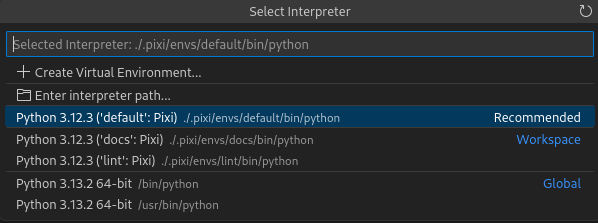

[Visual Studio Code](https://code.visualstudio.com/) is a popular editor that can be extended to support most programming languages by installing the suitable extension.

## Python Extension

First, install the Python extension from the [marketplace](https://marketplace.visualstudio.com/items?itemName=ms-python.python).
Typically, the extension will detect and select the Pixi default environment automatically as soon as you open a Python file.
In case it doesn't or you want to select a different environment, you can open the environment selector to select the environment of your choice.



## Direnv Extension

Direnv provides a language agnostic way of running VSCode in a Pixi environment.
First, install the Direnv extension from the [marketplace](https://marketplace.visualstudio.com/items?itemName=mkhl.direnv).
Then follow the instructions in our [Direnv doc page](../third_party/direnv.md).


## Devcontainer Extension

[VSCode Devcontainers](https://code.visualstudio.com/docs/devcontainers/containers) are a popular tool to develop on a workspace with a consistent environment.
They are also used in [GitHub Codespaces](https://github.com/features/codespaces) which makes it a great way to develop on a workspace without having to install anything on your local machine.

To use pixi inside of a devcontainer, follow these steps:

Create a new directory `.devcontainer` in the root of your workspace.
Then, create the following two files in the `.devcontainer` directory:

```dockerfile title=".devcontainer/Dockerfile"
FROM mcr.microsoft.com/devcontainers/base:jammy

ARG PIXI_VERSION=v0.54.2

RUN curl -L -o /usr/local/bin/pixi -fsSL --compressed "https://github.com/prefix-dev/pixi/releases/download/${PIXI_VERSION}/pixi-$(uname -m)-unknown-linux-musl" \
    && chmod +x /usr/local/bin/pixi \
    && pixi info

# set some user and workdir settings to work nicely with vscode
USER vscode
WORKDIR /home/vscode

RUN echo 'eval "$(pixi completion -s bash)"' >> /home/vscode/.bashrc
```

```json title=".devcontainer/devcontainer.json"
{
    "name": "my-workspace",
    "build": {
      "dockerfile": "Dockerfile",
      "context": "..",
    },
    "customizations": {
      "vscode": {
        "settings": {},
        "extensions": ["ms-python.python", "charliermarsh.ruff", "GitHub.copilot"]
      }
    },
    "features": {
      "ghcr.io/devcontainers/environments/docker-in-docker:2": {}
    },
    "mounts": ["source=${localWorkspaceFolderBasename}-pixi,target=${containerWorkspaceFolder}/.pixi,type=volume"],
    "postCreateCommand": "sudo chown vscode .pixi && pixi install"
}
```

!!!tip "Put `.pixi` in a mount"
    In the above example, we mount the `.pixi` directory into a volume.
    This is needed since the `.pixi` directory shouldn't be on a case insensitive filesystem (default on macOS, Windows) but instead in its own volume.
    There are some conda packages (for example [ncurses-feedstock#73](https://github.com/conda-forge/ncurses-feedstock/issues/73)) that contain files that only differ in case which leads to errors on case insensitive filesystems.

## Secrets

If you want to authenticate to a private conda channel, you can add secrets to your devcontainer.

```json title=".devcontainer/devcontainer.json"
{
    "build": "Dockerfile",
    "context": "..",
    "options": [
        "--secret",
        "id=prefix_dev_token,env=PREFIX_DEV_TOKEN",
    ],
    // ...
}
```

```dockerfile title=".devcontainer/Dockerfile"
# ...
RUN --mount=type=secret,id=prefix_dev_token,uid=1000 \
    test -s /run/secrets/prefix_dev_token \
    && pixi auth login --token "$(cat /run/secrets/prefix_dev_token)" https://repo.prefix.dev
```

These secrets need to be present either as an environment variable when starting the devcontainer locally or in your [GitHub Codespaces settings](https://github.com/settings/codespaces) under `Secrets`.
