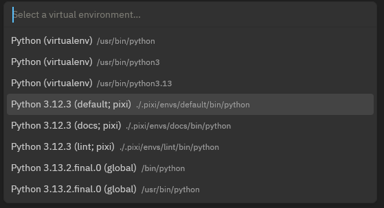

[Zed](https://zed.dev/) is a code editor that provides support for many languages out of the box.
By installing extensions more languages can be supported.

## Python

Zed supports Pixi and Python out of the box.
If Zed hasn't done so already, select a suitable Pixi environment in the environment selector and you are good to go!

## Direnv

Zed supports Direnv out of the box.
Set up Direnv with Pixi as described in our [Direnv page](../third_party/direnv.md) and Zed will activate the environment automatically.
