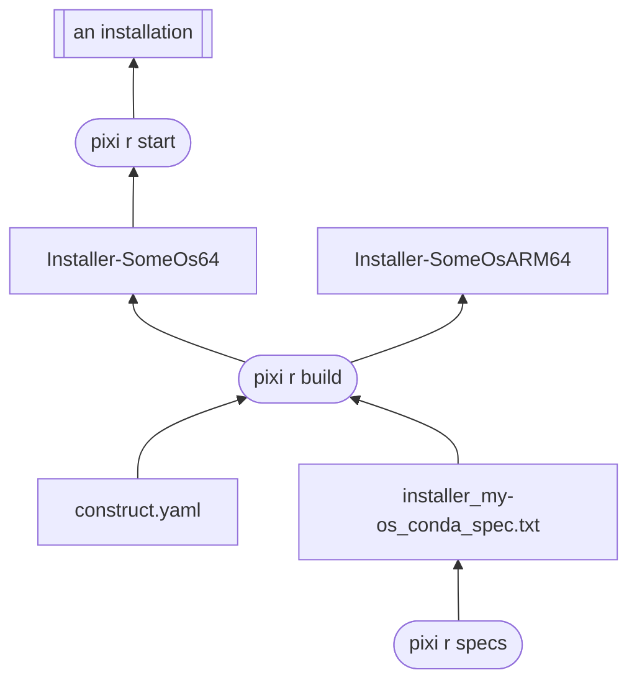

# Constructor Example

This demo shows how to use `pixi` to generate explicit `conda` environment specs,
and  [`constructor`][constructor] to use these specs to build platform-specific,
offline-ready installers.

## How to use?

Make sure you have `pixi` available in your terminal.

Navigate to this directory and run:

```shell
# Build the installer
pixi run build

# Install the built installer
pixi run start
```

[constructor]: https://conda.github.io/constructor
[rattler-build]: https://prefix-dev.github.io/rattler-build

## How does it work?


